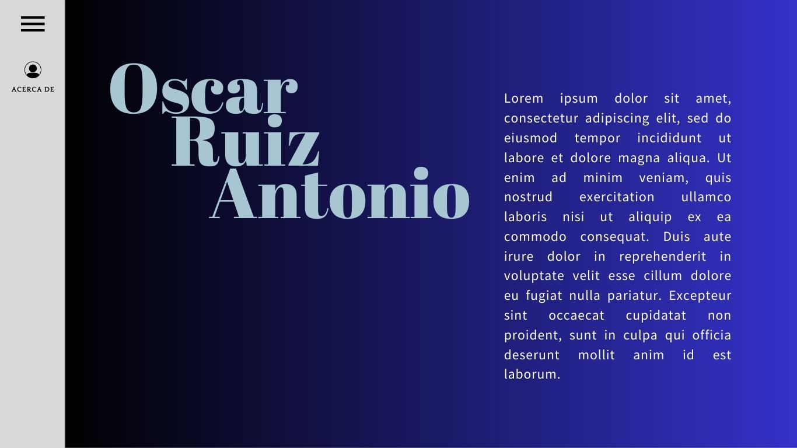

# Portafolio Dev. Oscar

## Contenido

1. Descripción
2. Necesidades del cliente
3. Criterio de aceptación
4. Diagrama de flujo
5. Maquetación

## Descripción

Sitio web que describe parte de la trayectoria profesional en materia de desarrollo software de Oscar Ruiz Antonio, así como datos generales que favorezcan la comunicación para el trabajo colaborativo en nuevos proyectos tecnológicos.

## Necesidades del Cliente

- Aprovechar las herramientas tecnológicas de comunicación para la creación de un portafolio digital.
- Favorecer la visulización de proyectos académicos y profesionales en materia de desarrollo software.
- Facilitar el contacto entre aquellos que deseen formar un equipo de trabajo para el desarrollo de proyectos.

## Criterio de Aceptación

Debe ser receptivo y en una URL para compartirlo y a su vez pueda consultarse desde un dispositivo móvil.

## Diagrama de Flujo

## Maquetación

This project was bootstrapped with [Create React App](https://github.com/facebook/create-react-app).